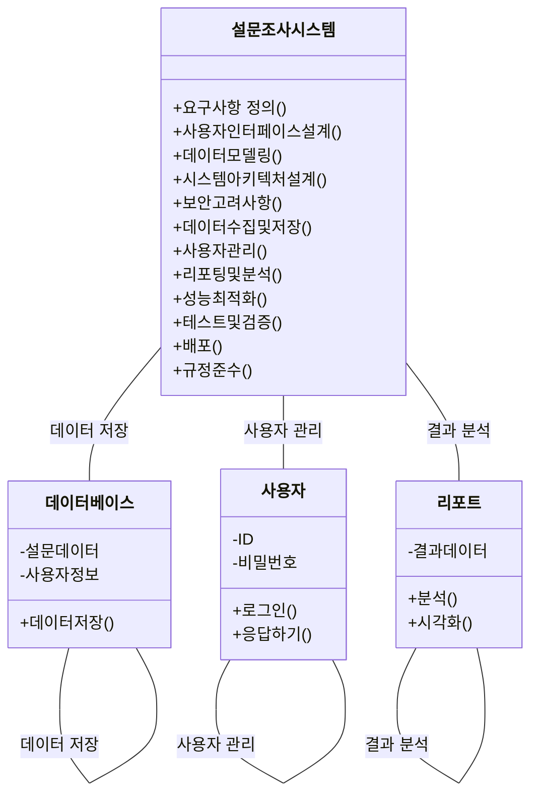

```mermaid
classDiagram
    class 설문조사시스템 {
        +요구사항 정의()
        +사용자인터페이스설계()
        +데이터모델링()
        +시스템아키텍처설계()
        +보안고려사항()
        +데이터수집및저장()
        +사용자관리()
        +리포팅및분석()
        +성능최적화()
        +테스트및검증()
        +배포()
        +규정준수()
    }

    class 데이터베이스 {
        -설문데이터
        -사용자정보
        +데이터저장()
    }

    class 사용자 {
        -ID
        -비밀번호
        +로그인()
        +응답하기()
    }

    class 리포트 {
        -결과데이터
        +분석()
        +시각화()
    }

    설문조사시스템 -- 데이터베이스: 데이터 저장
    설문조사시스템 -- 사용자: 사용자 관리
    설문조사시스템 -- 리포트: 결과 분석

    데이터베이스 -- 데이터베이스: 데이터 저장
    사용자 -- 사용자: 사용자 관리
    리포트 -- 리포트: 결과 분석

```
